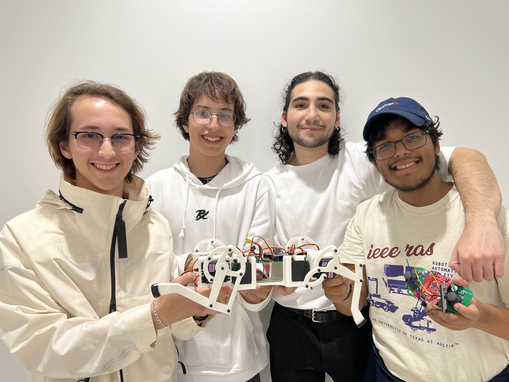
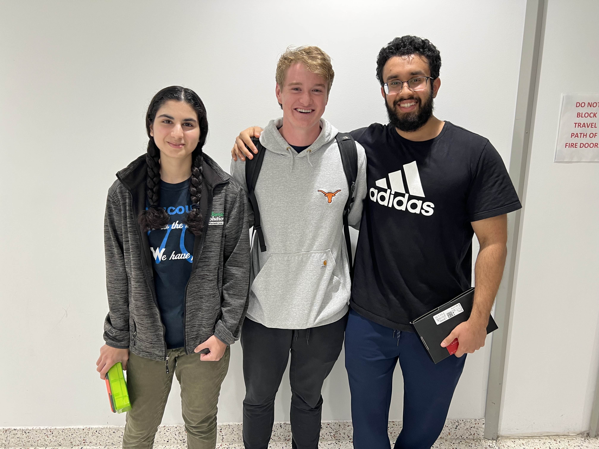

# Overview

This is the list of winners of the 445L Embeded System Design Labs.

## Spring 2025

**This could be you!**

1. TBA
2. TBA
3. TBA

## Fall 2024

1. Dawg
   - Team: Devin Kretschman, Dylan Kretschman, Lakshay Gupta, Roy Mor
   - Description: Robot dog that can walk, dance, and entertain
   - 
2. Piano
   - Team: Ethan Hale, Maanav Koladia, Nathan Williams, Sarah Khurram 
   - Description: Digital piano and keyboard with multiple tones and high fidelity
   - 
3. Arcade Range
   - Team: Ankit Patel, Arnav Vats, Paul Bessler, Sahil Shah 
   - Description: Arcade range where you compete to see who can knock over the most targets in a short time frame
   - 

Honorable Mention:

- Sound Shooter
  - Team: Kanaan Macias, Ravi Patel, Ryan Zheng, Stephanie Goff
  - Description: Shoot invisible enemies you can only hear with your trusty sound shooter
  - 

## Spring 2024

[445L and 445M Showcase - Spring 2024 | Flickr](https://www.flickr.com/photos/utece/albums/72177720316482407/)

1. Drag Racers
   - Team: Connor Leu, Frank Collebrusco, Rocco Perciavalle, Sajid Bhuiyan
   - Description: 
   - 
   - 
   - 
2. tPod
   - Team: Joon Song, Prithvi Senthilkumar, Siddhant Pandit, Wyatt Cole
   - Description: The tPod is a music player device that can play multiple songs and send messages to other tPods
   - 
   - 
   - 
3. Fishinator (TIED for third)
   - Team: Luis Abhijay Bhaskaran, Duarte Gonzalez, Jeremy Tran, Noah Najvar 
   - Description:
   - 
4. Game boy emulator (TIED for third)
   - Team: Arnold Venter, Ishan Deshpande, Luke Mason, Nadia Houston
   - Description:
   - 

Honorable Mention:

- Garfield Wheel
  - Team: Calvin Heischman, Gabriel Moore
  - Video: HID-compliant (and Garfield-themed) game controller with embedded button mapping firmware and gyroscope controls
  - 

## Fall 2023

1. Dance Dance Revolution
   - Team: Aditi Sarlashkar, Aniketh Devarasetty, Audrey Pick, Jeff Teng
   - Description: Minature Arcade cabiniet, with 'online' play, and adjustible difficulty
   - 
   - 
2. Keyboard
   - Team: April Douglas, Eric Wang, Jenna May, Matija Jankovic 
   - Description: USB/Bluetooth keyboard with integrated bongocat that types with you and WPM counter 
3. RC Car
   - Team: Jefferson Fu-Yao Yu, Kevin Wang, Mads Hojgaard, Wesley Holcomb
   - Description: Minature car with telemetry, autonomous function, and remote control
   - [Video](./23Fa/3%20car.mp4)

## Spring 2023

[Flickr Album](https://www.flickr.com/photos/utece/albums/72177720307763148)

1. Laser Tag
   - Team: Anthony Hermez, Avyay Ramanathan, Vincent Liew, Vivek Keval
   - Description: Laser Tag, 1st place by coin flip
2. Laser Tag
   - Team: Ben Endara, Jackson Schilling, Minseo Park, Tianfang Guo
   - Description: Laser Tag, 2nd place by coin flip
3. No Third place was assigned for this year.

## Fall 2022

[Flickr Album](https://www.flickr.com/photos/utece/albums/72177720304164658/)

1. MyCampusNav
   - Team: Alejandro Nunez Bravo, Jackson Carmichael, Jason Kacines, Hayden Pietsch 
   - Description: Compass that points you in the direction of the UT Tower or other buildings
2. Dancing Bevo
   - Team: Austin James, Elise Johnson, Noah Zamarripa, Reece Lehmann
   - Description: Dancing Bevo Doll Animatronic that dances and lights up with music played via aux-in.
3. MegaMouse:
   - Team: Aeybel Varghese, Brandon King, Daniel Sosa, Harsh Bakadia
   - Description: USB HID Mouse that is controlled by head movements and gesture recognition. Used to control a plane in Warthunder+MSFT Flight sim.

## Spring 2022

[Flickr Album](https://www.flickr.com/photos/utece/albums/72177720298776787)

1. DS Emulator
   - Team: Alex Ali, Alex Liu, Joe Lawler, Jorge Lopez    
   - Description: Replica of Nintendo DS
2. Music Glove
   - Team: Cole Choe, Jesse Valdelamar, Ravi Akalkotkar, Wilson Odom
   - Description: Glove with flex resistors to play different notes/light up on the different fingers.
3. Manhunt EX
   - Team: Alec Neiman, Julian Wearden, Ryan McSweeney, Zachary Bouthillette
   - Description: Multiplayer laser tag-like game played over WiFi hotspot

## Fall 2021

1. The Bob Ross Device
   - Team: Malav Shah, Meha Halabe, Franklin Mao, Jordon Kashanchi
   - Video: [https://www.youtube.com/watch?v=qhullwgcdUA](https://www.youtube.com/watch?v=qhullwgcdUA)
2. 3-D printer
   - Team: Kellan Cerveny, Edaline Engmann, Sammy Shin, Wilhelm Bagcal
   - Video: [https://www.youtube.com/watch?v=GXcW5YrqNoA&t](https://www.youtube.com/watch?v=GXcW5YrqNoA&t)
3. HUDset
   - Team: Lisong Sun, Kerry Tu, Dakota Britton, Casey Kim
   - Video: [https://youtu.be/10rfZ0_9bQ0](https://youtu.be/10rfZ0_9bQ0)

Honorable Mention:

- Keyboard
  - Team: Jared McArthur, Caroline Li, Josh Urbana, Kevin Tsai
  - Video: [https://youtu.be/CgJ-hUdc0HQ](https://youtu.be/CgJ-hUdc0HQ)

## Spring 2021

1. Lightsaber
   - Team: Adeel Rehman, Allen Jiang, Sophia Jiang, Xiangyi Chen
   - Video: [https://youtu.be/Yrs18WD5HyQ](https://youtu.be/Yrs18WD5HyQ)
2. Haptic Mouse
   - Team: Matthew Yu, Kevin Mechler, Arshad Bacchus
   - Video: [https://youtu.be/ZX0DsBXqy6Q](https://youtu.be/ZX0DsBXqy6Q)
3. Fallout Pip-Boy Mk445
   - Team: Alan Zhang,    Jesse Zhang, Ricky Tiet, Quockhang Truong
   - Video: [https://youtu.be/ibu6JXT-HoI](https://youtu.be/ibu6JXT-HoI)

Honorable Mention:

- Multifunction Voice Assistant
  - Team: Xylon Vester, Vittorio Adeagbo, Evan Canter, Olanike
  - Video: [https://www.youtube.com/watch?v=KaX962jlKoo](https://www.youtube.com/watch?v=KaX962jlKoo)

## Fall 2020

1. GPS
   - Team: Ashlynn Turbett, Burak Biyikli, Carter Milch, Joshua Bestor
   - Video: [https://youtu.be/JPR61UeS5lc](https://youtu.be/JPR61UeS5lc)
2. UT Calc
   - Team: Pete Fan, Sai Koukuntla, Ethan Golla, Vincent Tarzi
   - Video: [https://www.youtube.com/watch?v=qJLHiARLvFs](https://www.youtube.com/watch?v=qJLHiARLvFs)
3. WiFi connected 3-D printed robotic hand
   - Team: Dillon Heinen, David Janosky, Blake Margolis, Will Worthington
   - Video: [https://www.youtube.com/watch?v=QjJwSEB_Ok0](https://www.youtube.com/watch?v=QjJwSEB_Ok0)

Honorable Mentions:

- The Box
  - Team: Manolo Alvarez, Emilio Cantu, Ethan Denfeld, Adrian Garza
  - Video: [https://www.youtube.com/watch?v=CKHXlHFCdsg](https://www.youtube.com/watch?v=CKHXlHFCdsg)
- Face Following Camera 
  - Team: Paul Thompson, Niko Kumar, Dilya Anvarbekova, Emily Buergler
  - Video: [https://www.youtube.com/watch?v=sR5MQfJuiuw](https://www.youtube.com/watch?v=sR5MQfJuiuw)

## Spring 2020

Lost to time due to COVID. Message us if you have info
=== MISING INFO ===

1. ===MISSING PROJECT===
   - Team: ===MISSING MEMBERS===
   - Description: ===MISSING DESCRIPTION===
2. ===MISSING PROJECT===
   - Team: ===MISSING MEMBERS===
   - Description: ===MISSING DESCRIPTION===
3. ===MISSING PROJECT===
   - Team: ===MISSING MEMBERS===
   - Description: ===MISSING DESCRIPTION===

## Spring 2019

[Flickr Album](https://www.flickr.com/photos/utece/albums/72157707020741981/)

## Fall 2018

1. LED Globe
   - Team: Rita Kambil,, Shivani Gupta, Keeshan Patel, Shawn Victor
   - Video:
     - [https://www.dropbox.com/scl/fi/i58llpj85nrwsnfmzrbpw/IMG_2591.MOV?rlkey=923a41ywpqxhvwr9w5t0lxjip](https://www.dropbox.com/scl/fi/i58llpj85nrwsnfmzrbpw/IMG_2591.MOV?rlkey=923a41ywpqxhvwr9w5t0lxjip) 
     - [https://www.dropbox.com/scl/fi/euk5jrkbplxelcal1uiyh/IMG_2599.MOV?rlkey=oxj3wtr5ottbqxja2373f7x1i](https://www.dropbox.com/scl/fi/euk5jrkbplxelcal1uiyh/IMG_2599.MOV?rlkey=oxj3wtr5ottbqxja2373f7x1i)
     - [https://www.dropbox.com/scl/fi/59n8kpu24bo6fkfgsjoww/IMG_2600.MOV?rlkey=tivbc67bi58j0zxyin2hpn8l3](https://www.dropbox.com/scl/fi/59n8kpu24bo6fkfgsjoww/IMG_2600.MOV?rlkey=tivbc67bi58j0zxyin2hpn8l3)
2. Cell Phone
   - Team: Oluwole Akeredolu, Gilad Croll, Benjamin Thorell, Yaw Turkson

## Spring 2018

[Flickr Album](https://www.flickr.com/photos/utece/albums/72157666561386457/)

## Spring 2017

[Flickr Album](https://www.flickr.com/photos/utece/albums/72157683377703805)

## Fall 2016

[Flickr Album](https://www.flickr.com/photos/utece/albums/72157677460597315)

## Spring 2016

[Flickr Album](https://www.flickr.com/photos/utece/albums/72157668180718675)

## Fall 2015

[Flickr Album](https://www.flickr.com/photos/utece/albums/72157661313361679)

## Fall 2013

[Flickr Album](https://www.flickr.com/photos/utece/albums/72157638421692293)

## Fall 2012

[Flickr Album](https://www.flickr.com/photos/utece/albums/72157632190581651)

[Cockrell News Article](https://www.ece.utexas.edu/news/ee-445l-winners-announced)

1. Midi Loop Station
   - Team: Joe Martinez and Bassem Iskander
2. Teaching Piano
   - Team: Bryan Brumm and Mochi Li
3. Theremin
   - Team: Ford Rylander and Forrest Stallings
4. Lie Detector
   - Team: Joel East and Tyler McDonnell

## Fall 2011

[Flickr Album](https://www.flickr.com/photos/utece/albums/72157628323074175)

## The Ancient Past

Ancient history, the class existed but no records can be found.